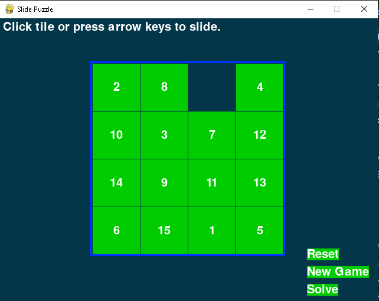

# Puzzle Game

Puzzle Game is a simple game developed using Pygame library. The game allows the user to move the puzzle pieces around the screen using the mouse. The game graphics are drawn using Pygame, and the display is updated at a rate of 60 frames per second.



## Installation

To install and play the game, follow these steps:

1. Clone or download the repository to your local machine.
2. Install Pygame library by running the following command in your terminal:

    ```
    pip install pygame
    ```

3. Run the game by executing the `puzzle_game.py` file using Python:

    ```
    python main.py
    ```

## How to Play

- Use the mouse to click and drag the puzzle pieces around the screen.
- Arrange the pieces to form the complete image.
- Have fun!

## Social Media

Follow us on social media for more updates and games:

- Twitter: [@yousefmohamad_](https://twitter.com/yousefmohamad_)
- Facebook: [Yousef Mohamad Abdala](https://www.facebook.com/profile.php?id=100075281388722)
- Instagram: [yavi.exe](https://www.instagram.com/yavi.exe/)

## License

The Puzzle Game is open source software licensed under the [MIT license](LICENSE).
